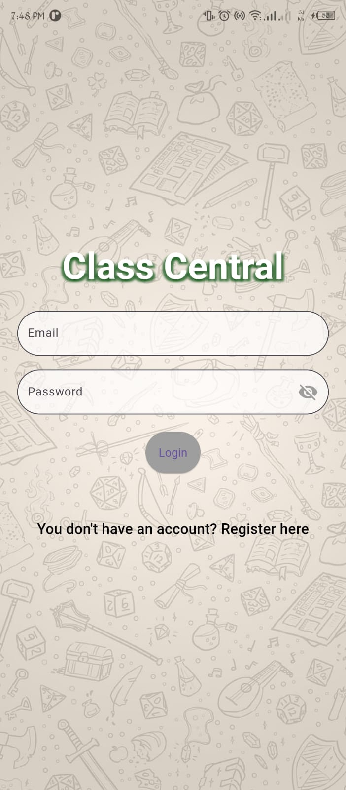
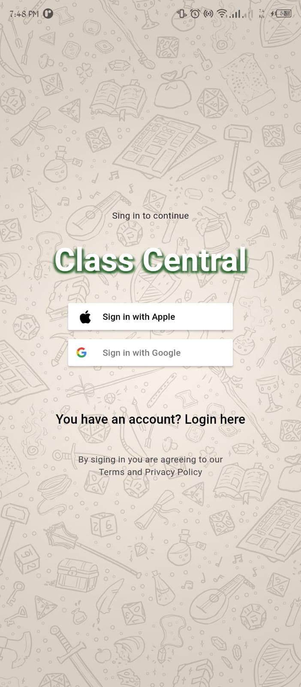
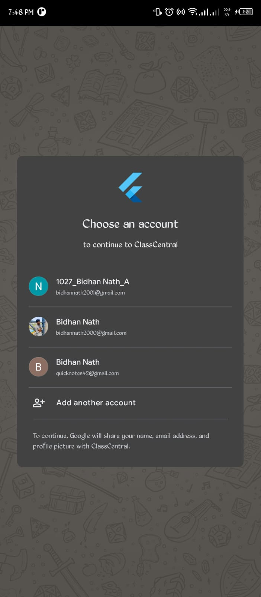
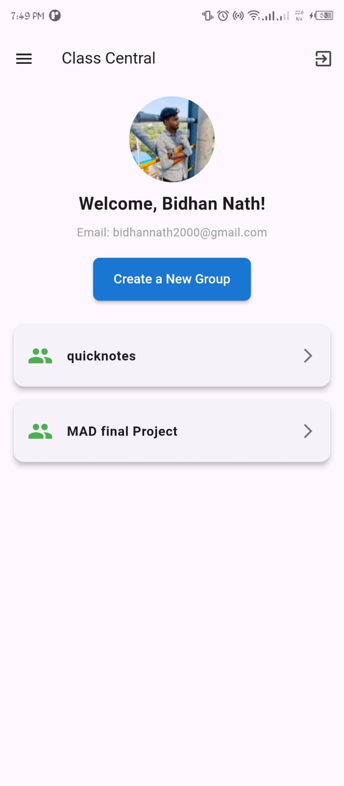
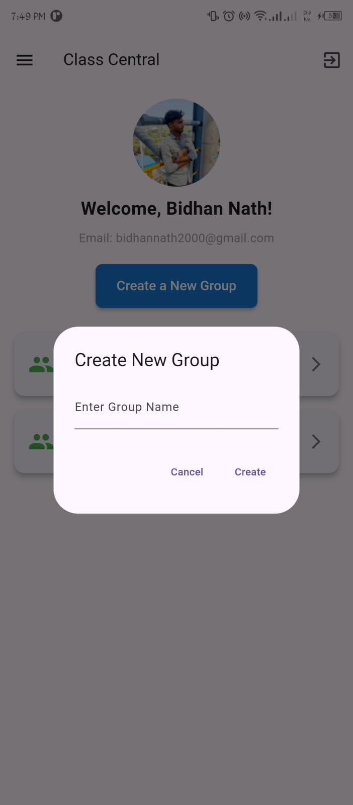
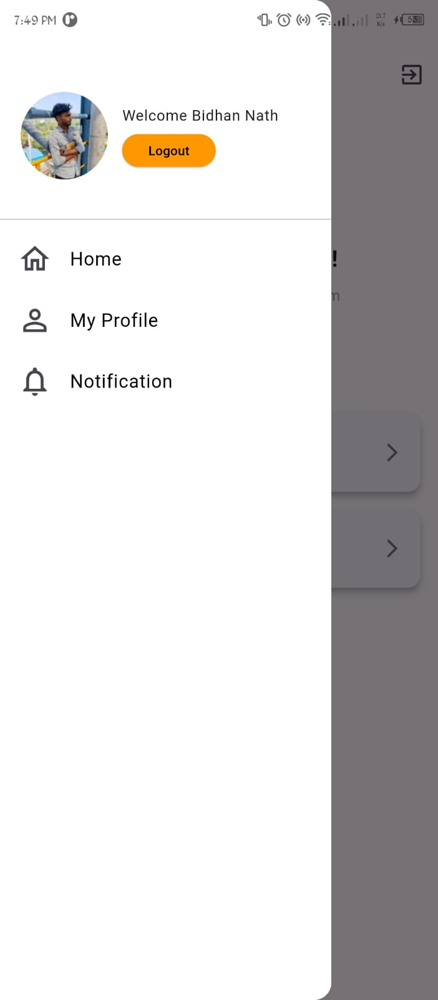
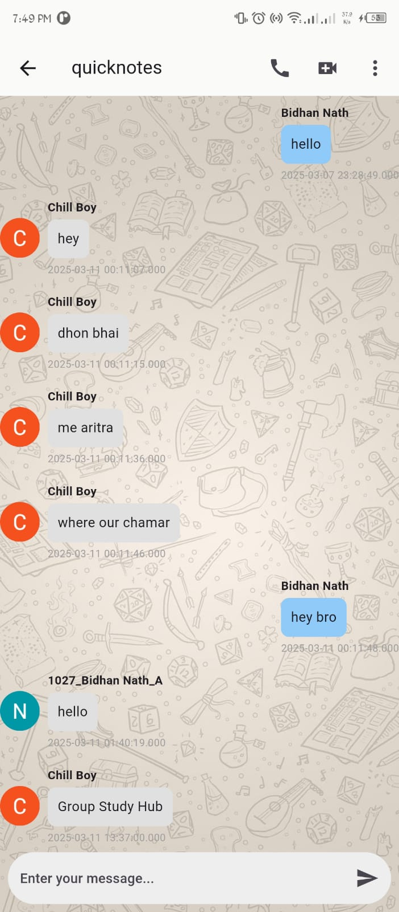
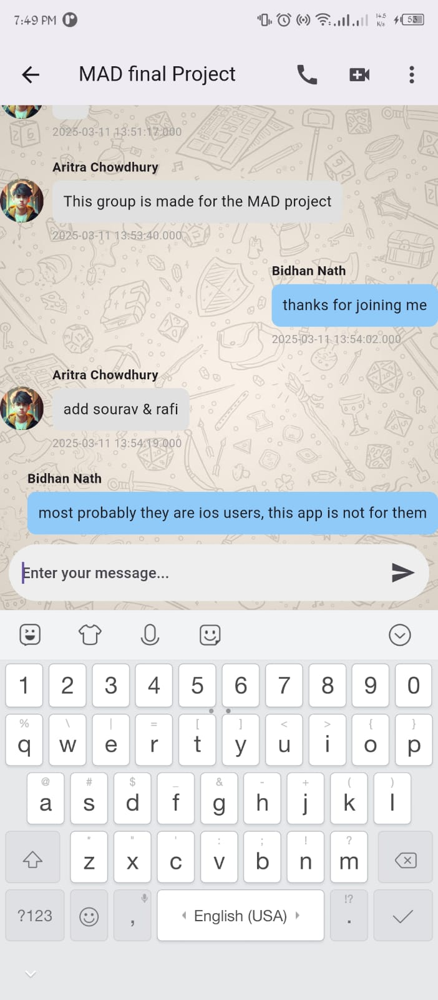

# MAD_Project
Mobile Application Development project named "ClassCentral" using Flutter
## App Screenshots

<table>
  <tr>
    <td align="center">
      
       <b>login Screen</b>
    </td>
    <td align="center">
      
       <b>sign up Screen</b>
    </td>
    <td align="center">
      
       <b>Google Account Selection</b>
    </td>
  </tr>
  <tr>
    <td align="center">
      
       <b>Home Page</b>
    </td>
    <td align="center">
      
       <b>Create New group</b>
    </td>
    <td align="center">
      
       <b>Drawer</b>
    </td>
  </tr>
  <tr>
    <td align="center">
      
       <b>Chat Screen</b>
    </td>
    <td align="center">
      
       <b>Chat Screen</b>
    </td>
    <td align="center">
      
       <b>Options</b>
    </td>
  </tr>
  <tr>
    <td align="center">
      
       <b>Add Member</b>
    </td>
    <td align="center">
      
       <b>Member List</b>
    </td>
    <td align="center">
      <!-- Empty cell for 11th image if needed -->
    </td>
  </tr>
</table>
